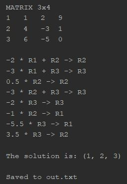
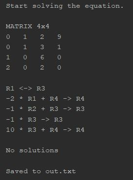
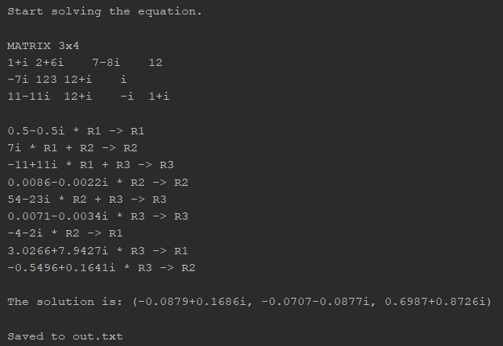
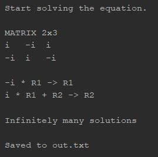

# Linear Equations Solver

Solves a system of linear equations using 
It is operated via the command line.

Completed as part of the **Hyperskill JetBrains Academy Java Developer Track**.

Difficulty: Medium

### Features
* Solves systems having both real and complex coefficients
* Outputs step-by-step method for finding the solution, if it exists.
* Formats numbers to improve legibility (such as removing trailing zeros)
* Has option for precision of answers (eg: upto 3 decimal places)

### Demonstration

The program is written to take inputs from the commmand line. Below are the following options that can be passed:

1. **-in**: [No default value!] The path to the input text file. 
2. **-out**: [No default value!] The path the the output text file.

#### Input File Format

1. The first line of the input text file should contain the number of variables followed by a space followed by the number of equations.
2. Subsequent lines should contain the coefficients separated by spaces.
3. Complex numbers must be represented as <real>+<imag>i where <real> and <imag> are the values of the real and imaginary parts respectively. 
4. Don't include the '+' symbol if <imag> is negative. Ensure there are no spaces between any of the symbols of the complex number
5. You can omit the real or imaginary parts if their values are equal to zero. 
6. Examples of acceptable numbers: "i", "-i", "0", "-34.89", "12", "43+i", "54-i", "90.87+43i"
7. Examples of unacceptable numbers: "50 + 20i", "- 0.7 + -9i", "6 i"

#### Output File Format

1. If no solutions exist, the program simply writes "No solutions" to the file.
2. If infinite solutions exist, the program simply writes "Infinitely many solutions" to the file.
3. If an unique solution exists, the program prints the value of each variable on a separate line.

Demo of unique solution with real coefficients

Demo of no solution with real coefficients

Demo of unique solution with imaginary coefficients

Demo of infinitely many solutions with imaginary coefficients

### Dependencies

None; uses built-in Java libraries only

### Requirements

A fairly recent JDK

### Resources

* [Java Official Documentation](https://docs.oracle.com/javase/8/docs/)
* [GeeksForGeeks](https://www.geeksforgeeks.org/)
* [StackOverflow](https://stackoverflow.com/)

### To Do List

- [ ] Change to a GUI